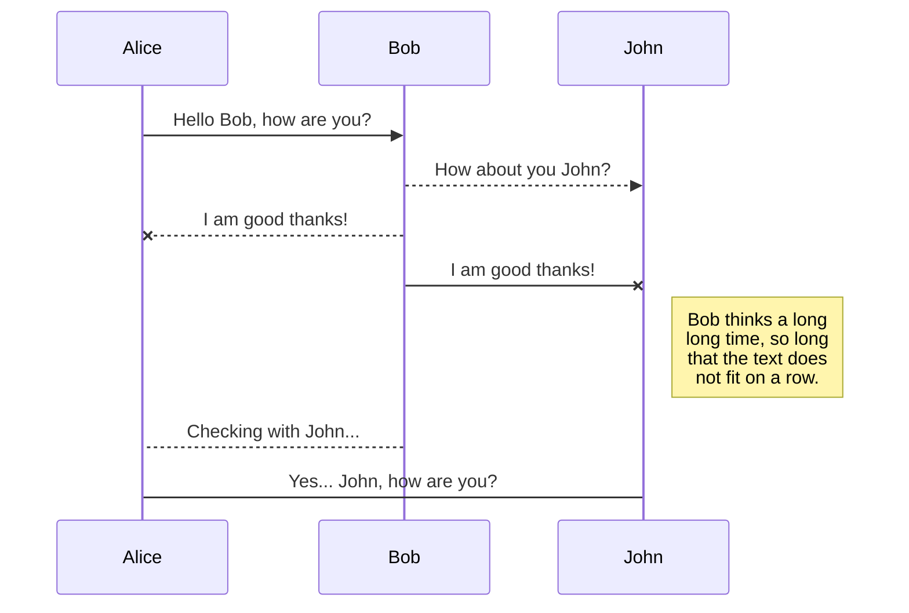
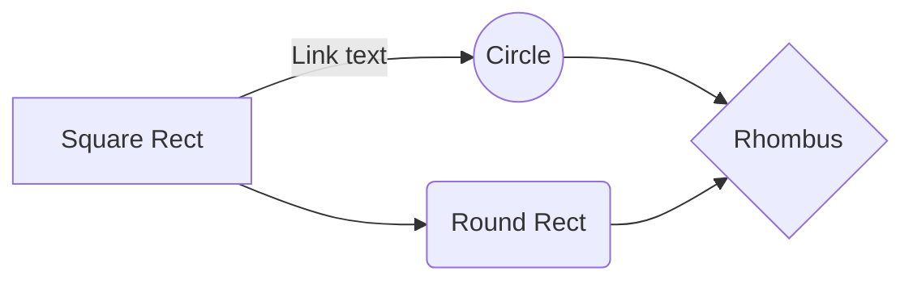

# Tutorial - Trabalho Prático 1

Este tutorial contêm o processo básico usado para desenvolver o trabalho prático 1 da disciplina de Laboratório de Sistemas Operacionais (CC). Este trabalho consiste na geração de uma distribuição Linux que possua um servidor WEB implementado em Python ou C/C++. Este servidor WEB deverá servir uma página HTML contendo informações básicas sobre o sistema (maquina target, onde o servidor estará sendo executado). Segundo o enunciado, as informações que devem ser apresentadas pela página HTML seriam:

* Data e hora do sistema;
* Uptime (tempo de funcionamento sem reinicialização do sistema) em segundos;
* Modelo do processador e velocidade;
* Capacidade ocupada do processador (%);
* Quantidade de memória RAM total e usada (MB);
* Versão do sistema;
* Lista de processos em execução (pid e nome).

Para este trabalho, a implementação do servidor WEB será em Python.

Para mais informações, consulte o enunciado original presente neste anexo (nomeado como 'tp1.pdf').

# Tutorial

StackEdit stores your files in your browser, which means all your files are automatically saved locally and are accessible **offline!**

## 1. Configurando o Buildroot

Para este trabalho, foi utilizada uma distribuição linux para plataforma x86 e emulada com o QEMU, seguindo o mesmo padrão das atividades realizadas em aula. Assim como nos exemplos em aula também, foi utilizada a versão 2022.02 do Buildroot.

### 1.1 Obtendo o Buildroot
Como já mencionado, iremos fazer uso da versão 2022.02 do Buildroot, portanto podemos seguir os mesmos passos utilizados nos exemplos em aula para obter e preparar os arquivos necessários da ferramenta:

1. Fazer download da versão 2022.02 diretamente do site oficial (buildroot.org)

      $ wget --no-check-certificate https://buildroot.org/downloads/buildroot-2022.02.tar.gz
      
2. Descompactar o arquivo baixado para o diretório `linuxdistro` e renomear o diretório extraído para `buildroot`

      $ tar -zxvf buildroot-2022.02.tar.gz
      $ mv buildroot-2022.02/ buildroot/

### 1.2 Configuração arquitetura

Assim como tambem mencionado anteriormente, iremos gerar uma distribuição para plataformas x86 para emulação com o QEMU, portanto iremos configurar o Buildroot para tal:

      $ make qemu_x86_defconfig

### 1.3 Customizações do Kernel e da distribuição

Aqui faremos as seguintes customizações através da interface de configuração do Buildroot:

  $ make menuconfig

* Desativar a configuração DHCP da interface de rede (como feito em aula)
* Configurar a porta TTY para ttyS0 (como feito em aula)

    System configuration  ---> 
  	 ()  Network interface to configure through DHCP
  	 [*] Run a getty (login prompt) after boot  --->
  		  (ttyS0) TTY port
 
* Configurar o Buildroot para executar o script (`pre-build.sh`) antes da geração da imagem do rootfs. Esse script sera criado e adicionado no proximo passo e sera necessário para configurar as configurações de rede da maquina guest durante a inicializacao. (mais sobre isso na seção 3)

    System configuration  --->
    	(custom-scripts/pre-build.sh) Custom scripts to run before creating filesystem images

* Habilitar suporte WCHAR. Como estamos utilizando Python, será necessário habilitar o suporte WCHAR para tornar possível a codificação de strings UTF-16

    Toolchain  ---> 
  		  [*] Enable WCHAR support

* Incluir Python3 à distribuição: Como mencionado anteriormente, iremos fazer a implementação do servidor WEB utilizando a linguagem de programação Python. Para isso, precisaremos incluir o interpretador da Linguagem em nossa distribuição do Linux.

    Target packages  ---> 
  	     Interpreter languages and scripting  --->
  		  [*] python3

Saia do menu de configurações salvando essas opções.

A seguir, entraremos no menu de configuraciones do kernel Linux:

`$ make linux-menuconfig`

Aqui faremos as seguintes customizações:

* Habilitar o driver Ethernet e1000 (como feito em aula)

  Device Drivers  ---> 
  	[*] Network device support  --->    
  		[*]   Ethernet driver support  ---> 
  		<*>     Intel(R) PRO/1000 Gigabit Ethernet support
  		
Saia do menu de configurações salvando essas opções.

Apos isso, podemos iniciar a compilação do sistema

`$ make`

### 1.4 Configurações dos scripts para inicializaçao da rede

No diretório buildroot/, criaremos um diretório chamado ´custom-scripts´, com o objetivo de manter scripts de configuração personalizados:

  ´´´
  $ mkdir custom-scripts
  ´´´
Iniciaremos criando um arquivo denominado ´qemu-ifup´ com o conteúdo abaixo no diretório custom-scripts: 

´´´
#!/bin/sh
set -x

switch=br0

if [ -n "$1" ];then
        ip tuntap add $1 mode tap user `whoami`		#create tap network interface
        ip link set $1 up				#bring interface tap up
        sleep 0.5s					#wait the interface come up.
        sysctl -w net.ipv4.ip_forward=1                 # allow forwarding of IPv4
	route add -host 192.168.1.10 dev $1 		# add route to the client
        exit 0
else
        echo "Error: no interface specified"
        exit 1
fi
´´´

Esse script irá habilitar uma interface rede tap (virtual) para o sistema guest.

Em seguida, precisaremos configurar a interface de rede do sistema guest para se comunicar com o sistema host. Para isso, crie um script chamado ´S41network-config´ com o conteudo abaixo, substituindo <IP-DO-HOST> pelo ipv4 da máquina host:

´´´
#!/bin/sh
#
# Configuring host communication.
#

case "$1" in
  start)
	printf "Configuring host communication."
	
	/sbin/ifconfig eth0 192.168.1.10 up
	/sbin/route add -host <IP-DO-HOST> dev eth0
	/sbin/route add default gw <IP-DO-HOST>
	[ $? = 0 ] && echo "OK" || echo "FAIL"
	;;
  stop)
	printf "Shutdown host communication. "
	/sbin/route del default
	/sbin/ifdown -a
	[ $? = 0 ] && echo "OK" || echo "FAIL"
	;;
  restart|reload)
	"$0" stop
	"$0" start
	;;
  *)
	echo "Usage: $0 {start|stop|restart}"
	exit 1
esac

exit $?
´´´

Crie mais um arquivo denominado ´pre-build.sh´, com o conteúdo abaixo: 

´´´
#!/bin/sh
cp $BASE_DIR/../custom-scripts/S41network-config $BASE_DIR/target/etc/init.d
chmod +x $BASE_DIR/target/etc/init.d/S41network-config
	
´´´
	
O script acima será copiado para o diretório /etc/init.d (no sistema de arquivos do guest) antes do build da distribuição e será executado durante a inicialização do sistema.
	
Por fim, de permissão de execução para o script pre-build.sh. 
	
´´´chmod +x custom-scripts/pre-build.sh
´´´

* Desativar a configuração DHCP da interface de rede (como feito em aula)
* Configurar a porta TTY para ttyS0 (como feito em aula)

    System configuration  ---> 
  	 ()  Network interface to configure through DHCP
  	 [*] Run a getty (login prompt) after boot  --->
  		  (ttyS0) TTY port
 
* Configurar o Buildroot para executar o script (`pre-build.sh`) antes da geração da imagem do rootfs. Esse script sera criado e adicionado no proximo passo e sera necessário para configurar as configurações de rede da maquina guest durante a inicializacao. (mais sobre isso na seção 3)

    System configuration  --->
    	(custom-scripts/pre-build.sh) Custom scripts to run before creating filesystem images

* Habilitar suporte WCHAR. Como estamos utilizando Python, será necessário habilitar o suporte WCHAR para tornar possível a codificação de strings UTF-16

    Toolchain  ---> 
  		  [*] Enable WCHAR support

* Incluir Python3 à distribuição: Como mencionado anteriormente, iremos fazer a implementação do servidor WEB utilizando a linguagem de programação Python. Para isso, precisaremos incluir o interpretador da Linguagem em nossa distribuição do Linux.

    Target packages  ---> 
  	     Interpreter languages and scripting  --->
  		  [*] python3

Saia do menu de configurações salvando essas opções.

A seguir, entraremos no menu de configuraciones do kernel Linux:

`$ make linux-menuconfig`

Aqui faremos as seguintes customizações:

* Habilitar o driver Ethernet e1000 (como feito em aula)

  Device Drivers  ---> 
  	[*] Network device support  --->    
  		[*]   Ethernet driver support  ---> 
  		<*>     Intel(R) PRO/1000 Gigabit Ethernet support
  		
Saia do menu de configurações salvando essas opções.

Apos isso, podemos iniciar a compilação do sistema

`$ make`

## 2. Iniciando a emulação

Apos a finalização da compilação, podemos seguir para a emulação da distribuição recém compilada:

1. Monte a imagem do sistema de arquivo em sua maquina alvo:

	`$ mount -o loop output/images/rootfs.ext2 ../rootfs/`

2. Execute o comando abaixo para emular:

	 $ sudo qemu-system-i386 --device e1000,netdev=eth0,mac=aa:bb:cc:dd:ee:ff \
	--netdev tap,id=eth0,script=custom-scripts/qemu-ifup \
	--kernel output/images/bzImage \
	--hda output/images/rootfs.ext2 --nographic \
	--append "console=ttyS0 root=/dev/sda"

Caso o comando qemu-system-i386 nao seja encontrado, será necessário instalar o QEMU no sistema host:

$ sudo apt-get install qemu-system

Para encerrar o QUEMU, abra outro terminal e execute:

  $ killall qemu-system-i386

## Rename a file

You can rename the current file by clicking the file name in the navigation bar or by clicking the **Rename** button in the file explorer.

## Delete a file

You can delete the current file by clicking the **Remove** button in the file explorer. The file will be moved into the **Trash** folder and automatically deleted after 7 days of inactivity.

## Export a file

You can export the current file by clicking **Export to disk** in the menu. You can choose to export the file as plain Markdown, as HTML using a Handlebars template or as a PDF.

# Synchronization

Synchronization is one of the biggest features of StackEdit. It enables you to synchronize any file in your workspace with other files stored in your **Google Drive**, your **Dropbox** and your **GitHub** accounts. This allows you to keep writing on other devices, collaborate with people you share the file with, integrate easily into your workflow... The synchronization mechanism takes place every minute in the background, downloading, merging, and uploading file modifications.

There are two types of synchronization and they can complement each other:

- The workspace synchronization will sync all your files, folders and settings automatically. This will allow you to fetch your workspace on any other device.
	> To start syncing your workspace, just sign in with Google in the menu.

- The file synchronization will keep one file of the workspace synced with one or multiple files in **Google Drive**, **Dropbox** or **GitHub**.
	> Before starting to sync files, you must link an account in the **Synchronize** sub-menu.

## Open a file

You can open a file from **Google Drive**, **Dropbox** or **GitHub** by opening the **Synchronize** sub-menu and clicking **Open from**. Once opened in the workspace, any modification in the file will be automatically synced.

## Save a file

You can save any file of the workspace to **Google Drive**, **Dropbox** or **GitHub** by opening the **Synchronize** sub-menu and clicking **Save on**. Even if a file in the workspace is already synced, you can save it to another location. StackEdit can sync one file with multiple locations and accounts.

## Synchronize a file

Once your file is linked to a synchronized location, StackEdit will periodically synchronize it by downloading/uploading any modification. A merge will be performed if necessary and conflicts will be resolved.

If you just have modified your file and you want to force syncing, click the **Synchronize now** button in the navigation bar.

> **Note:** The **Synchronize now** button is disabled if you have no file to synchronize.

## Manage file synchronization

Since one file can be synced with multiple locations, you can list and manage synchronized locations by clicking **File synchronization** in the **Synchronize** sub-menu. This allows you to list and remove synchronized locations that are linked to your file.

# Publication

Publishing in StackEdit makes it simple for you to publish online your files. Once you're happy with a file, you can publish it to different hosting platforms like **Blogger**, **Dropbox**, **Gist**, **GitHub**, **Google Drive**, **WordPress** and **Zendesk**. With [Handlebars templates](http://handlebarsjs.com/), you have full control over what you export.

> Before starting to publish, you must link an account in the **Publish** sub-menu.

## Publish a File

You can publish your file by opening the **Publish** sub-menu and by clicking **Publish to**. For some locations, you can choose between the following formats:

- Markdown: publish the Markdown text on a website that can interpret it (**GitHub** for instance),
- HTML: publish the file converted to HTML via a Handlebars template (on a blog for example).

## Update a publication

After publishing, StackEdit keeps your file linked to that publication which makes it easy for you to re-publish it. Once you have modified your file and you want to update your publication, click on the **Publish now** button in the navigation bar.

> **Note:** The **Publish now** button is disabled if your file has not been published yet.

## Manage file publication

Since one file can be published to multiple locations, you can list and manage publish locations by clicking **File publication** in the **Publish** sub-menu. This allows you to list and remove publication locations that are linked to your file.

# Markdown extensions

StackEdit extends the standard Markdown syntax by adding extra **Markdown extensions**, providing you with some nice features.

> **ProTip:** You can disable any **Markdown extension** in the **File properties** dialog.

## SmartyPants

SmartyPants converts ASCII punctuation characters into "smart" typographic punctuation HTML entities. For example:

|                |ASCII                          |HTML                         |
|----------------|-------------------------------|-----------------------------|
|Single backticks|`'Isn't this fun?'`            |'Isn't this fun?'            |
|Quotes          |`"Isn't this fun?"`            |"Isn't this fun?"            |
|Dashes          |`-- is en-dash, --- is em-dash`|-- is en-dash, --- is em-dash|

## KaTeX

You can render LaTeX mathematical expressions using [KaTeX](https://khan.github.io/KaTeX/):

The *Gamma function* satisfying $\Gamma(n) = (n-1)!\quad\forall n\in\mathbb N$ is via the Euler integral

$$
\Gamma(z) = \int_0^\infty t^{z-1}e^{-t}dt\,.
$$

> You can find more information about **LaTeX** mathematical expressions [here](http://meta.math.stackexchange.com/questions/5020/mathjax-basic-tutorial-and-quick-reference).

## UML diagrams

You can render UML diagrams using [Mermaid](https://mermaidjs.github.io/). For example, this will produce a sequence diagram:

And this will produce a flow chart:

