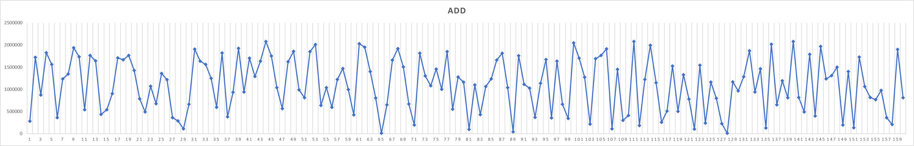
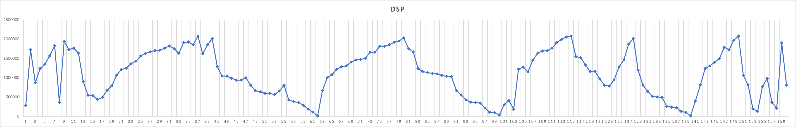

# Trabalho Prático 2


Este relatório descreve o processo básico usado para desenvolver o trabalho prático 2 da disciplina de Laboratório de Sistemas Operacionais (CC). Este trabalho consiste na implementação de um escalonador de disco, baseado no algoritmo de SSTF (Shortest Seek Time First). O escalonador deve ser implementado como um módulo compatível com o Linux kernel 4.13.9. Após a implementação desse algoritmo, o desempenho do mesmo deve ser comparado com o desempenho de um algoritmo de First Come, First Served.


Para este trabalho, a implementação do escalonador será em C.


Para mais informações, consulte o enunciado original presente neste anexo (nomeado como 'tp2.pdf').


# Implementação do escalonador


A implementação do escalonador foi com ponto de partida no esqueleto de código fornecido aula, disponível em https://github.com/miguelxvr/sstf-iosched-skeleton.git. A partir daí foram adicionadas as seguintes modificações:


## função sstf_get_next_rq


Essa função é responsável por determinar qual é o próximo request de acesso ao disco que será processado (seguindo as regras do algoritmo SSTF). A implememtação considerou que o disco é um vetor simples, com início e final que não estão conectados entre si. Assim, caso o cabeçote do disco esteja na última posição e precise acessar a primeira posição, ele terá de cruzar todo o disco. Uma implementação diferente também é sugerida mais abaixo.

Essa função recebe os seguintes argumentos como parâmetro:

* `struct sstf_data *nd` : ponteiro para a struct de dados que encapsula a head da nossa fila `queue` de requests
* `struct request **next`: ponteiro do ponteiro da struct que representa o proximo request a ser computado pela função. Esse paremetro é um parametro de saída, e é através dele que a função irá retornar o próximo request computado para ser despachado.


O código da função é o seguinte:


```
static void sstf_get_next_rq(struct sstf_data *nd, struct request **next){
        unsigned long long int min_blk_distance = ULLONG_MAX;

        struct request *currentRq = NULL;

        struct list_head* position; struct list_head* temp; list_for_each_safe(position, temp, &nd->queue) {

                struct request *rq = list_entry(position, struct request, queuelist);

                unsigned long long int blk_distance = abs(blk_rq_pos(rq) - last_blk_pos_dispatched);

                if (blk_distance < min_blk_distance) {

                        min_blk_distance = blk_distance;

                        currentRq = rq;
                }
        }

        *next = currentRq;
}
```

A variável `min_blk_distance` é usada para encontrar a distãncia mínima que existirá entre a atual posição do cabeçote e as requisições que estão esperando na fila. Ela é inicializada com o valor máximo de um `long long int` (mesmo tipo de dado utilizado pela representação de setores do disco no kernel) e será atribuída a um novo valor (menor), sempre que for encontrada uma distancia de blocos menor do que a atual durante a iteração pela lista encadeada de requests. A função `list_for_each_safe` é uma função [disponível na especificação de estruturas de dados do kernel Linux](https://github.com/torvalds/linux/blob/master/include/linux/list.h). Essa função itera pela lista de requests, atribuindo o cursor que representa a posição atual da lista ao parâmetro `position`. Após isso, obtemos o request dessa posição da lista através da função `list_entry(...)`, onde passamos a `list_head` representando o cursor da posição atual da lista, a struct de dados que está encapsulando nosso `list_head` (`struct request`) e o nome atribuído a nossa `list_head` dentro da struct `request` (`queuelist`).
Para cada request então presente em nossa fila de requisições, calculamos a distância entre a posição atual do cabeçote e a posição a ser acessada na requisição em questão, com a seguinte fórmula:


```abs(blk_rq_pos(rq) - last_blk_pos_dispatched)
```

- A função `blk_rq_pos(..)` é utilizada para obter a posição de um request, passando o mesmo por parâmetro.
- A variável last_blk_pos_dispatched é uma variavel global que mantém sempre a posição de bloco do ultimo request despachado.
- O uso do valor absoluto garante que a distância estará em uma mesma escala, seja para uma posição de memória à esquerda ou à direita da posição atual.

O algoritmo então encontra a requisição que possuí a menor distância entre a posição atual e a requisição e salva o endereço dessa requisição na no valor de next, que, em seguida, é utilizada na função `sstf_dispatch`, descrita abaixo.


## sstf_dispatch


É a função que faz o dispatch da requisição para o disco. O ponteiro para uma struct `request` (`rq`) é inicializada com o valor nulo e seu endereço é passado paraa função `sstf_get_next_rq` descrita acima para que essa encontre qual é o próximo request a ser servido, retornando o resultado para `rq`. Note-se o uso da função `list_del_init` para a retirada do request que está sendo servido da lista de requests. Essa função também está disponível na especificação 'list.h' do kernel Linux

```

static int sstf_dispatch(struct request_queue *q, int force){

        struct sstf_data *nd = q->elevator->elevator_data;

        struct request *rq = NULL;

        sstf_get_next_rq(nd, &rq);


        if (rq) {

                list_del_init(&rq->queuelist);

                elv_dispatch_sort(q, rq);


                char direction = sstf_get_cursor_direction(last_blk_pos_dispatched, blk_rq_pos(rq));

                last_blk_pos_dispatched = blk_rq_pos(rq);

                printk(KERN_EMERG "[SSTF] dsp %c %llu\n", direction, blk_rq_pos(rq));

                return 1;
        }
        return 0;
}
```


Depois que o request é servido, a posição do cabeçote é atualizada, ficando salva na variável `last_blk_pos_dispatched`, que é usada na função `sstf_get_next_rq`. Note-se que, para a primeira execução, a variável `last_blk_pos_dispatched` é inicializada com o valor 0.


## Outra implementação para o algoritmo do escalonador


Acaso desejado adaptar o algoritmo para considerar o disco como um vetor com ligação do início e do fim, seria necessário calcular, para cada elemento da lista de requests, a distância do cabeçote e do elemento considerando a seguinte equação:

```
MIN(ABS(posição_do_cabeçote - posição_do_request), (tamanho_máximo_do_disco + posição_do_request - posição_do_cabeçote)).
```


# Tutorial de execução

A implementação do módulo seguiu as instruções dos tutoriais disponibilizados na disciplina, em especial os tutoriais [
Tutorial 2.3: Meu primeiro Device Driver (v1.2)
](https://moodle.pucrs.br/pluginfile.php/4185973/mod_resource/content/2/2.3%20-%20driver_hello_world.html) e [
Tutorial 2.4: Noções sobre IO-Scheduler e acesso a disco (v1.0)
](https://dl.dropboxusercontent.com/s/5ba8x2gw03ueil1/2.4%20-%20iosched.html?dl=0).

O esqueleto de codigo disponibilizado em https://github.com/miguelxvr/sstf-iosched-skeleton.git, já contém, além da implementação base para o algoritmo escalonador (`sstf-iosched.c`) uma aplicação de testes (`sector_read.c`) que executa leituras aleatórias no disco para testar o desempenho do algoritmo. Essa aplicação teste faz uso da [chamada de sistema `fork()`](https://www.geeksforgeeks.org/fork-system-call/) para criar vários processos simultaneos da aplicação de teste, de forma que o acesso ao disco não seja sequencial, facilitando a utilização do mecanismo principal de escalonamento para priorizar as requisições de leitura por menor distância. É possível customizar o número de subprocessos que desejamos executar alterando a constante `FORKS`
``` c
// Exemplo com 4 subprocessos
#define FORKS 4
```
Ainda assim, o esqueleto de código já fornece um `Makefile` para automatizar o processo de cross-compilação e adição dos dois programas
na distribuição. A unica customização necessária no `Makefile` foi a edição do caminho absoluto para o diretório raiz do buildroot, como no exemplo abaixo:
``` Makefile
obj-m := sstf-iosched.o
BUILDROOT_DIR := ./../  # <== Adicione aqui o caminho para o diretorio do buildroot
KDIR := $(BUILDROOT_DIR)/output/build/linux-custom
COMPILER := $(BUILDROOT_DIR)/output/host/bin/i686-buildroot-linux-uclibc-gcc
...
..
.
```

Dito isso, para replicar o processo de execução e testes do novo algoritmo escalonador, deve-se seguir o seguinte procedimento:

*O código fonte do escalonador e do programa de testes (desenvolvido a partir do esqueleto de código) está presente dentro do diretório `modules` a partir do diretório raiz do buildroot (repositório).

1- Entre no diretório do módulo e execute o `Makefile` para compilar os fontes e adicionar a distribuição:
``` bash
$ cd modules/sstf-iosched
$ make
```
2- Agora volte ao diretório raiz do Buildroot e execute o make para atualizar a imagem do kernel
``` bash
$ cd ../..
$ make
```

3- Será necessário criar um arquivo que servirá como disco de testes para o escalonador. Esse disco de testes não irá conter um sistema de arquivos (filesystem) válido. Iremos usar o comando `dd` para criar um arquivo, usando como entrada `/dev/zero` e como saída o arquivo `sdb.bin`. O parâmetro `bs` é o `block size`, ou seja, o tamanho de cada bloco de dados. Enquanto que `count` é a quantidade de blocos copiados. Assim, 512*2097152=1GB.
No diretório do Buildroot, execute: 

``` bash
$ dd if=/dev/zero of=sdb.bin bs=512 count=2097152
```

4- Feito isso, agora queremos que o QEMU reconheça o arquivo sdb.bin como uma imagem de disco. Para adicionar a nova imagem de disco ao QEMU é necessário incluir o mesmo no comando de execução do QEMU.

``` bash
$ qemu-system-i386 --kernel output/images/bzImage --hda output/images/rootfs.ext2 --hdb sdb.bin --nographic --append "console=ttyS0 root=/dev/sda"
```

Ao executar o QEMU, deve aparecer um dispositivo sdb no sistema:

``` bash
# ls /dev/sdb -lh
brw-------    1 root     root        8,  16 Sep 18 18:15 /dev/sdb
```
A imagem de disco será acessada através do dispositivo `/dev/sdb`.

5- Agora precisamos carregar o nosso modulo escalonador
``` bash
# modprobe sstf-iosched
```

6- Feito isso, já podemos configurar o sistema para fazer uso do nosso novo escalonador.
O comando abaixo deve listar o nosso novo escalonador

``` bash
# cat /sys/block/sdb/queue/scheduler
noop deadline [cfq] sstf
```

O algoritmo em execução é apresentado entre colchetes. Obtenha mais informações sobre os escalonadores de disco, configuração de parâmetros de escalonadores e gerenciamento em: http://cromwell-intl.com/linux/performance-tuning/disks.html

Para trocar de algoritmo basta efetuar o comando abaixo, com o nome do nosso algoritmo desejado (`sstf`):

``` bash
# echo sstf > /sys/block/sdb/queue/scheduler
```

Verifique se o comando funcionou:

``` bash
# cat /sys/block/sdb/queue/scheduler
noop deadline cfq [sstf] 
`bash`

6- Feito isso, podemos seguir para a execução do nosso programa de testes `sector_read`, que foi compilado e copiado para o diretório `/bin` do sistema:

``` bash
$ sector_read
```

No nosso algoritmo escalonador, adicionamos as chamadas de sistema `printk(...)` para logar nos logs do kernel quando uma requisição era adicionada e despachada. O programa `sector_read` já reflete os logs dessas chamadas em sua execução, mas caso quisessemos vizualiza-los novamente, bastaria ler do arquivo `/var/log/messages` onde são logadas as mensagens do kernel.


# Avaliação de desempenho

Com as mensagens do kernel geradas a partir da execução do escalonador, é possível fazermos a análise de desempenho do algoritmo implementado, quando comparado com uma implementação "First Come First Served". Para isso, foram feitos gráficos que representam a ordem da adição das requisições à fila (que representam como seria o tratamento das requisições por um algoritmo FCFS) e a ordem da execução das requisições pelo algoritmo implementado. Para a amostra demonstrada abaixo, a aplicação de testes foi executada com o valor de `FORKS=4`, ou seja, executando 4 subprocessos adicionais simultaneos para adicionar estresse nas leituras do disco. Os gráficos se encontram nas figuras abaixo, e estão juntadas ao repositório. A análise visual dos gráficos já traz a intuição de que as posições das requisições servidas pelo algoritmo implementado são muito mais próximas uma da outra do que seriam no caso do algoritmo FCFS. As seções do gráfico DSC onde há sequencias que não foram servidas necessáriamente na menor ordem significam que não havia nenhuma requisição adicionada na fila naquele momento especifico.

As saídas utilizadas para a geração dos gráficos abaixo estão juntadas nesse reposítório, no diretório raiz, nomeadas como [add.txt](add.txt) para a sequencia de saídas representando as adições de requisições na fila e [dsp.txt](dsp.txt) para a sequencia de saídas representando os despachos (atendimentos) das requisições da fila.

### Ordem de adições (semlhante a ordem de um algoritmo FCFS)


### Ordem de despacho (escalonamento SSTF)



Para formalizar a intuição em um parâmetro objetivo, foi calculado a distância total percorrida pelo cabeçote para cada um dos algoritmos. A distãncia total para o FCFS foi de 116618744, enquanto para o algoritmo SSTF implementado foi de 33607128. Ou seja, o FCFS exigiu ~= 3,47 vezes mais trabalho do que o algoritmo SSTF implementado.


| OPERAÇÃO     | Quantidade total | Distância total percorrida|
|--------------|------------------|---------------------------|
| ADD          | 160              | 116618744                 |
| DSP          | 160              | 33607128                  |


## Autora


**Sarah Lacerda / 2022.1**

Código disponibilizado em: https://github.com/sarah-lacerda/linuxdistro/tree/tp2
